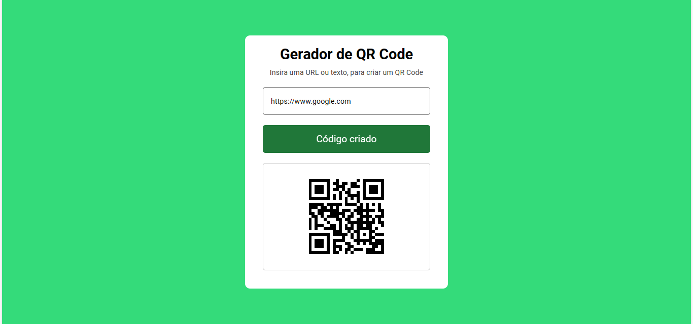

# Projeto: Gerador de QR Code
Para esse projeto utilizamos recursos de HTML, CSS, JavaScript e uma API de QR Code. 
O código tem um trecho de validação de inserção de dados, que verifica se o campo de input está preenchido. 
O QR Code é gerado quando é inserido uma url ou um texto no campo de input de dados.

# Tecnologias: 
HTML 
CSS 
JavaScript 
Git/Github
